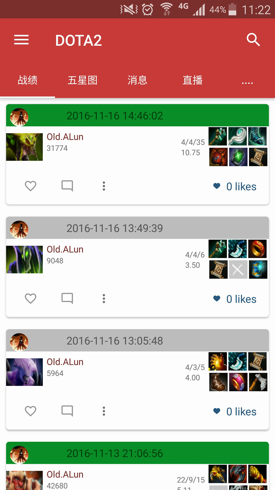
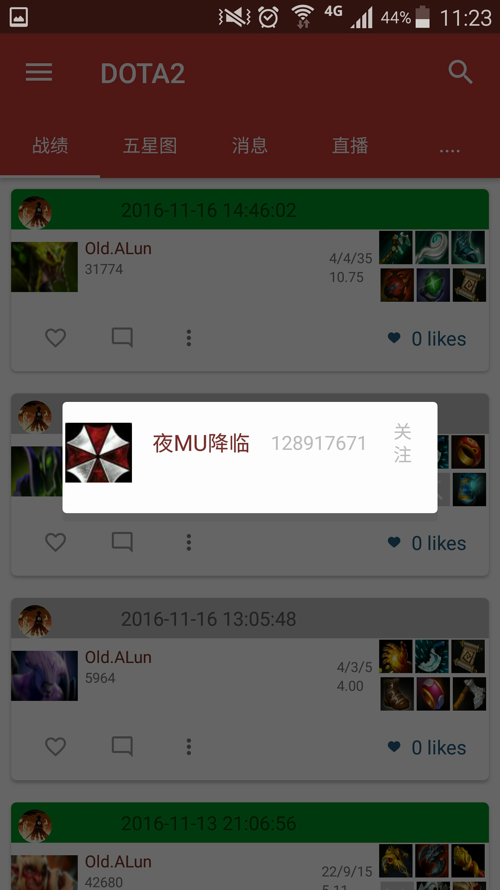
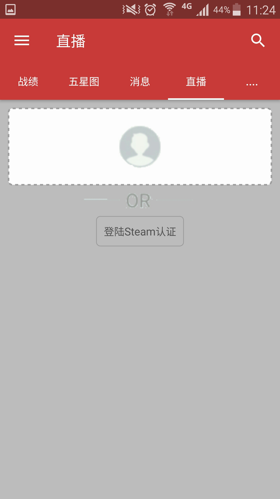

# AndroidMonkey (Dota2数据App)

##备注：

steam32 id  转换为steam64 id
STEAMID32 + 76561197960265728 = STEAMID64
参考网站：
- [Scohura博客园](http://dev.dota2.com/showthread.php?t=58317)

运行效果：好友真实数据：

>对于AndroidMonkey 这个项目，名字就这样吧，稍微吐槽一下就可以了，目前已经实现了，从官方接口读取数据，到本地数据库显示，个人战绩
##使用到的技术：
多线程
- 图片缓存(DiskLruCache  和LruCache)
- HttpConnect（图片的下载）
- Volley（和HttpConnect不同的体验网络访问处理方法）
- 简单的数据库知识
- service（Intentservice 更加方便 ）
- broadcast(LocalBroadcastManager)
- ContentProvider(目前最大的收获，使用provider和CursorFilter 相结合，来达到recycleView数据实时加载)

ps :Dota2 APP在将来会持续更新中..欢迎大家指点意见！